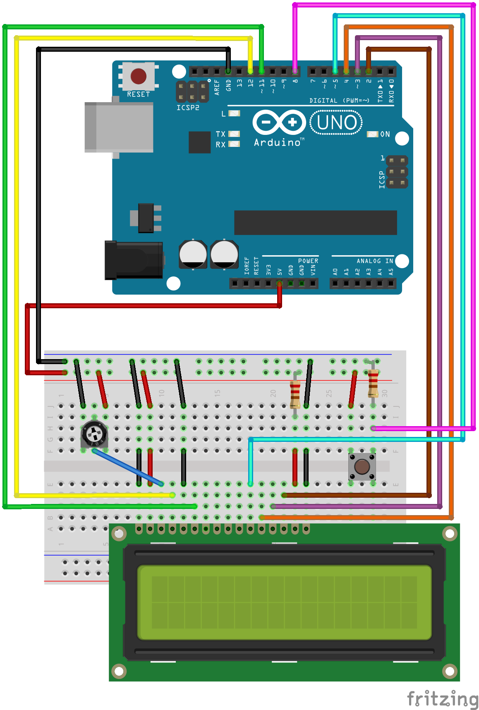

<h1 align="center">La petite fabrique à histoires 👋</h1>
<p>
  
  <a href="https://www.gnu.org/licenses/gpl-3.0.html" target="_blank">
    
  </a>
  <a href="https://twitter.com/AtelierRaptoria" target="_blank">
    
  </a>
</p>

> Génération d'histoires très courtes affichées sur une écran relié à une Arduino
[https://raptoria.fr/electronique/la-petite-fabrique-a-histoires](https://raptoria.fr/electronique/la-petite-fabrique-a-histoires)

## 🤖 Matériel
⚫ 1 carte Arduino
⚫ 1 breadboard
⚫ 1 écran LCD
⚫ 1 potentiomètre
⚫ 1 bouton poussoir
⚫ 1 résistance 10kΩ
⚫ 1 résistance 220Ω
⚫ câbles

## 🔌 Câblage


## 💻 Installation

```sh
pip install -r requirements.txt
```

## 📖 Usage

Compiler et téléverser le script `petite-fabrique-a-histoires.ino` sur votre Arduino puis lancer la commande suivante :

```sh
python histoires.py --port <port de votre Arduino>
```

Pour profiter des histoires, il suffit d'appuyer sur le bouton poussoir 😁


## ❓ Un problème, une question ?

En cas de problème, veuillez jeter un coup d'oeil sur [page des tickets](https://gitlab.com/AtelierRaptoria/petite-fabrique-a-histoires/-/issues).<br />Si vous ne trouvez pas la réponse à votre problème ou votre question, n'hésitez pas à ouvrir un nouveau ticket.

## 🤝 Contributions

Les contributions et suggestions sont les bienvenues !<br />Rendez-vous sur la [page des tickets](https://gitlab.com/AtelierRaptoria/petite-fabrique-a-histoires/-/issues).

## 🤩 Soutenir ce projet

Si ce projet vous a plu, n'hésitez pas à lui donner une ⭐️ !

## 💃 Raptoria

⚫ Site web : raptoria.fr
⚫ Twitter : [@AtelierRaptoria](https://twitter.com/AtelierRaptoria)
⚫ Gitlab : [@AtelierRaptoria](https://gitlab.com/AtelierRaptoria)
⚫ Github : [@AtelierRaptoria](https://github.com/AtelierRaptoria)

## 📝 License

Ce projet est sous licence [GNU GPLv3](https://www.gnu.org/licenses/gpl-3.0.html).
